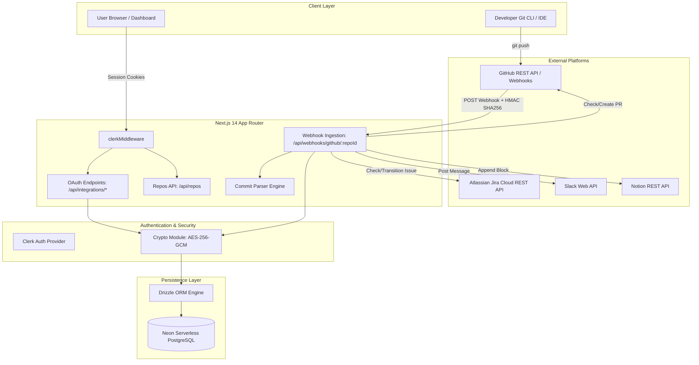

# Architecture & System Design

This document details the architectural foundation, security design, data flow, and components of **LS Ship**, a multi-tenant SaaS application ported from a legacy n8n automation pipeline.

---

## 🏗️ High-Level Architecture Diagram



---

## 📜 Background: The n8n Migration

### The Legacy Workflow (n8n)
In the original automation setup:
- A shared n8n webhook handled incoming pushes for a single organization.
- Secrets and tokens were shared globally in environment variables.
- When tokens expired (especially 1-hour Jira tokens), the entire automation broke for all team members.
- There was no self-service dashboard to manage repositories, preview events, or audit errors.

### The LS Ship Multi-Tenant SaaS Architecture
LS Ship reimagines this workflow as a secure, scalable, multi-tenant SaaS:
1. **Isolated Multi-Tenancy**: Every user connects their own OAuth integrations and manages their own repositories.
2. **Encrypted at Rest**: All third-party OAuth credentials and webhook HMAC secrets are encrypted with **AES-256-GCM** using unique initialization vectors (IVs) and authentication tags.
3. **Automated Provisioning**: When a repo is added, LS Ship provisions the webhook on GitHub via the API.
4. **Resilient Execution**: Commits are processed individually; a failure on one commit never crashes the batch.
5. **Auditable Event Log**: Every push, created PR, duplicate check, skipped commit, and parse error is logged to PostgreSQL and visible in the dashboard.

---

## 🧩 Core System Components

### 1. Ingestion & Signature Verification Layer
- **Route**: [`app/api/webhooks/github/[repoId]/route.ts`](file:///c:/Users/Girish%20Lade/OneDrive/Desktop/LS-Relay/ls-ship/app/api/webhooks/github/%5BrepoId%5D/route.ts)
- **Signature Verification**: Validates the `x-hub-signature-256` header against the repo's decrypted webhook secret using `crypto.timingSafeEqual` over the exact raw body bytes.
- **Safe Returns**: Always responds with HTTP 200/401 to prevent GitHub from marking webhooks as dead due to server errors.

### 2. Commit Parsing Engine
- **Module**: [`lib/commit-parser.ts`](file:///c:/Users/Girish%20Lade/OneDrive/Desktop/LS-Relay/ls-ship/lib/commit-parser.ts)
- **Expression**:
  ```regex
  ^([A-Z]+-\d+)\s(.*?)(?:\s\[(.*)\])?$
  ```
- **Rules**:
  - Extracts the Jira task key (e.g. `TASK-123`).
  - Extracts commit description.
  - Extracts automation flags (`auto-pr`, `taskcompleted`, or target base branches like `main`, `staging`).
  - Separates commits into `valid` and `invalid` lists.

### 3. Execution & Orchestration Layer
- **GitHub Execution** ([`lib/github/pr.ts`](file:///c:/Users/Girish%20Lade/OneDrive/Desktop/LS-Relay/ls-ship/lib/github/pr.ts)):
  - Checks if an open PR exists for the pushed branch.
  - If not found, opens a new PR targeted at the resolved base branch.
- **Jira Execution** ([`lib/jira/task.ts`](file:///c:/Users/Girish%20Lade/OneDrive/Desktop/LS-Relay/ls-ship/lib/jira/task.ts)):
  - Validates that the issue exists (`getTask`).
  - Transitions the task to "Development Done" (`updateTaskStatus`).

### 4. Notification Dispatcher
- Dispatches formatted activity notices to Slack and Notion in parallel using `Promise.allSettled()`.
- Guarantees that an API failure in Slack will never suppress or delay Notion logging.

### 5. Persistence & ORM Layer
- Powered by **Drizzle ORM** and **Neon Serverless PostgreSQL**.
- Connection pooling optimized for serverless environments via `@neondatabase/serverless`.

---

## 🔒 Security Architecture

```
                  ┌──────────────────────────────────────────────┐
                  │                 Plaintext                    │
                  └──────────────────────┬───────────────────────┘
                                         │
                                         ▼
                     AES-256-GCM Encryption (Crypto Key)
                                         │
                                         ▼
                  ┌──────────────────────────────────────────────┐
                  │ Format:  <iv_base64>:<tag_base64>:<cipher>   │
                  └──────────────────────┬───────────────────────┘
                                         │
                                         ▼
                  ┌──────────────────────────────────────────────┐
                  │            PostgreSQL Database               │
                  └──────────────────────────────────────────────┘
```

1. **AES-256-GCM Symmetric Encryption**:
   - Every encrypted record contains three colon-separated components: `IV:AuthTag:Ciphertext`.
   - Protects against data-at-rest leaks and ensures cryptographic tampering is detected upon decryption.
2. **One-Time Secret Exposure**:
   - Webhook secrets are returned in plaintext to the user interface **exactly once** during repository creation. After that, they can never be retrieved in plaintext from any API.
3. **Tenant-Scoped Mutations**:
   - All update and delete operations in the database require both `repoId` and `userId`, eliminating IDOR (Insecure Direct Object Reference) vulnerabilities.
4. **CSRF-Protected OAuth Flows**:
   - All OAuth providers receive the authenticated Clerk `userId` as the `state` parameter, preventing cross-account linking attacks.
