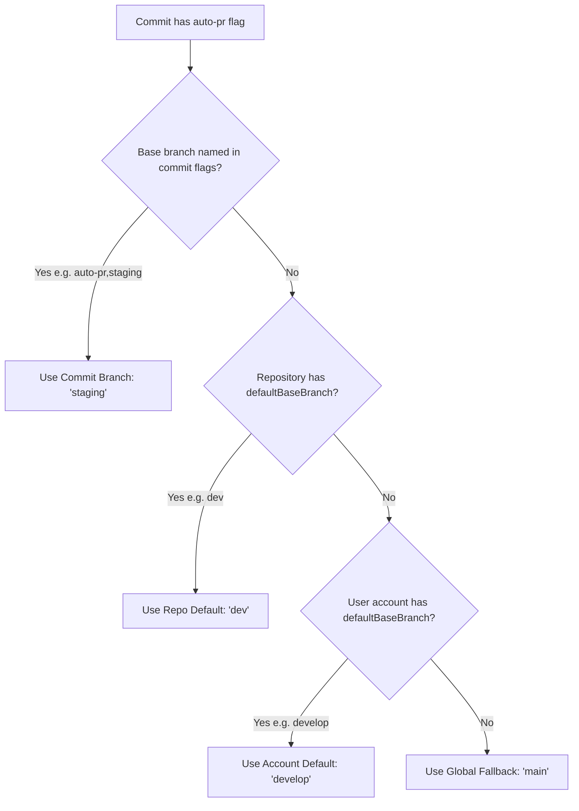

# Commit Conventions & Automation Flags

**LS Ship** processes Git commit messages using a standardized format to determine when to open pull requests, transition Jira tasks, and broadcast team notifications.

---

## 📐 Commit Message Syntax

Every commit message destined for automation should follow this structure:

```
<JIRA-KEY> <Commit Message Description> [flags]
```

### Regular Expression Breakdown

Located at [`lib/commit-parser.ts`](file:///c:/Users/Girish%20Lade/OneDrive/Desktop/LS-Relay/ls-ship/lib/commit-parser.ts):

```regex
^([A-Z]+-\d+)\s(.*?)(?:\s\[(.*)\])?$
```

| Match Group | Pattern | Description | Example |
| :--- | :--- | :--- | :--- |
| **Group 1** (`jiraKey`) | `^([A-Z]+-\d+)` | Uppercase Jira project prefix, hyphen, and issue number. | `PROJ-123`, `ENG-404`, `CORE-9` |
| **Group 2** (`commitDescription`) | `\s(.*?)` | Human-readable commit description following the first space. | `Add OAuth redirect verification` |
| **Group 3** (`flags`) | `(?:\s\[(.*)\])?$` | Optional comma-separated automation flags enclosed in brackets. | `[auto-pr,main]`, `[taskcompleted]` |

---

## 🏷️ Supported Automation Flags

Flags are placed inside trailing square brackets `[...]` and separated by commas. Whitespace around flags is automatically trimmed.

| Flag | Purpose | Behavior & Requirements |
| :--- | :--- | :--- |
| `auto-pr` | **Automated Pull Request** | Automatically opens a GitHub PR from the pushed branch against the resolved base branch. Checks for open PRs first to avoid duplicates. |
| `taskcompleted` | **Jira Status Transition** | Transitions the referenced Jira task into the **Development Done** status. |
| `<branch_name>` | **Target Base Branch** | Any flag that is not `auto-pr` or `taskcompleted` is treated as the target base branch name (e.g. `main`, `staging`, `develop`, `release/v1.0`). |

---

## 🎯 Base Branch Resolution Hierarchy

When a commit contains the `auto-pr` flag, LS Ship resolves the target base branch according to the following 4-level fallback hierarchy:



1. **Commit Message Flag**: Explicitly provided branch in commit (e.g. `[auto-pr,staging]`).
2. **Repository Default**: Configured per repository on the **Repos** dashboard page.
3. **Account Default**: Configured globally on the **Settings** dashboard page.
4. **System Fallback**: Defaults to `main`.

---

## 📋 Examples & Scenarios

| Commit Message | Parsed Flags | Actions Triggered | Event Status |
| :--- | :--- | :--- | :--- |
| `PROJ-101 Fix mobile navigation bar` | *(none)* | Tracked in audit log. No PR or Jira transition triggered. | `skipped` |
| `PROJ-102 Add dark mode toggle [auto-pr,main]` | `auto-pr`, `main` | Opens PR against `main`. Sends Slack/Notion notifications. | `pr_created` or `pr_exists` |
| `PROJ-103 Optimize database queries [auto-pr,staging]` | `auto-pr`, `staging` | Opens PR against `staging`. Sends Slack/Notion notifications. | `pr_created` or `pr_exists` |
| `PROJ-104 Fix CSS overflow bug [taskcompleted]` | `taskcompleted` | Moves `PROJ-104` to Development Done in Jira. Sends notifications. | `task_updated` |
| `PROJ-105 Full release flow [auto-pr,main,taskcompleted]` | `auto-pr`, `main`, `taskcompleted` | Opens PR against `main` **AND** moves Jira task to Development Done. | `pr_created` |
| `PROJ-106 Multi-flag arbitrary order [taskcompleted,auto-pr,develop]` | `taskcompleted`, `auto-pr`, `develop` | Opens PR against `develop` and marks Jira task done. Order does not matter. | `pr_created` |

---

## ⚠️ Invalid Commit Handling

Commits that do not adhere to the syntax convention are **never silently dropped**.

When an invalid commit arrives in a push payload:
1. LS Ship records the event in `webhookEvents` with status `invalid`.
2. The error message is formatted as:
   ```
   <sha_short> "<commit_message>": <failure_reason>
   ```
3. Processing continues immediately for any remaining valid commits in the same push batch.

### Common Invalid Formats & Reasons

| Invalid Commit Message | Error Reason |
| :--- | :--- |
| `Fix login validation error` | Missing task key prefix (must match `[A-Z]+-\d+`). |
| `proj-101 lowercase key [auto-pr,main]` | Task key prefix must be uppercase (`PROJ-101`). |
| `PROJ-102 [auto-pr,main]` | Missing commit message description between task key and flags. |
| `PROJ-103 Fix bug [auto-pr]` *(when no repo/account default is configured)* | `Commit message error: Please enter a base branch to create the PR in.` |
