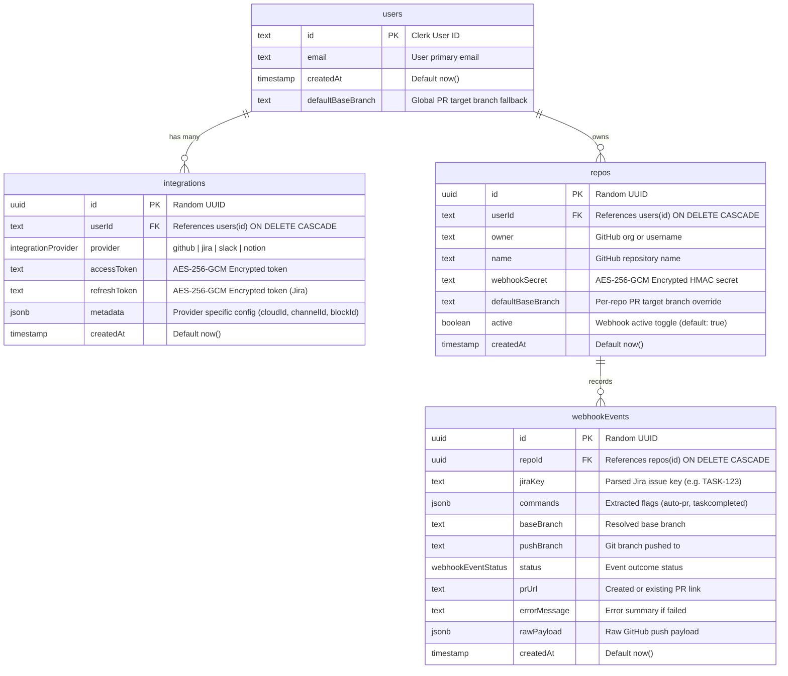

# Database & Schema Reference

**LS Ship** uses **Neon Serverless PostgreSQL** paired with **Drizzle ORM** for type-safe database access, automatic migrations, and connection pooling.

---

## 📊 Entity-Relationship Diagram (ERD)



---

## 🗄️ Schema Definition Reference

Located at [`lib/db/schema.ts`](file:///c:/Users/Girish%20Lade/OneDrive/Desktop/LS-Relay/ls-ship/lib/db/schema.ts):

### 1. Enums

#### `integrationProvider`
Defines supported third-party OAuth providers:
```typescript
export const integrationProvider = pgEnum("integrationProvider", [
  "github",
  "jira",
  "slack",
  "notion",
]);
```

#### `webhookEventStatus`
Defines the lifecycle and execution statuses for webhook events:
```typescript
export const webhookEventStatus = pgEnum("webhookEventStatus", [
  "received",      // Initial webhook receipt
  "invalid",       // Commit message did not match convention
  "pr_created",    // Successfully opened a new PR
  "pr_exists",     // PR already exists for branch; skipped duplicate creation
  "task_updated",  // Jira task transitioned to Development Done
  "skipped",       // Commit parsed successfully but had no automation flags
  "error",         // Error during execution (API failure, auth failure, etc.)
]);
```

---

### 2. Tables

#### `users`
Mirrors authenticated users from Clerk to maintain local foreign-key references.

| Column | Type | Constraints | Description |
| :--- | :--- | :--- | :--- |
| `id` | `text` | `PRIMARY KEY` | The unique Clerk User ID (e.g., `user_2...`). |
| `email` | `text` | `NOT NULL` | The user's primary email address. |
| `createdAt` | `timestamp` | `NOT NULL DEFAULT now()` | Timestamp when user was first mirrored. |
| `defaultBaseBranch` | `text` | `NULLABLE` | Global account fallback for PR base branches (e.g., `main`). |

---

#### `integrations`
Stores encrypted OAuth credentials and provider-specific metadata per user.

| Column | Type | Constraints | Description |
| :--- | :--- | :--- | :--- |
| `id` | `uuid` | `PRIMARY KEY DEFAULT gen_random_uuid()` | Unique integration record ID. |
| `userId` | `text` | `NOT NULL REFERENCES users(id) ON DELETE CASCADE` | The owning user. |
| `provider` | `integrationProvider` | `NOT NULL` | `github`, `jira`, `slack`, or `notion`. |
| `accessToken` | `text` | `NOT NULL` | **AES-256-GCM Encrypted** access token (`iv:tag:cipher`). |
| `refreshToken` | `text` | `NULLABLE` | **AES-256-GCM Encrypted** refresh token (used by Jira). |
| `metadata` | `jsonb` | `NOT NULL DEFAULT '{}'` | Stores provider configuration (e.g. `cloudId`, `channelId`, `blockId`, `expiresAt`). |
| `createdAt` | `timestamp` | `NOT NULL DEFAULT now()` | Creation timestamp. |

---

#### `repos`
Represents GitHub repositories connected to LS Ship.

| Column | Type | Constraints | Description |
| :--- | :--- | :--- | :--- |
| `id` | `uuid` | `PRIMARY KEY DEFAULT gen_random_uuid()` | Unique repository ID (used in webhook URLs). |
| `userId` | `text` | `NOT NULL REFERENCES users(id) ON DELETE CASCADE` | Owning user. |
| `owner` | `text` | `NOT NULL` | GitHub organization or username (e.g., `vercel`). |
| `name` | `text` | `NOT NULL` | GitHub repository name (e.g., `next.js`). |
| `webhookSecret` | `text` | `NOT NULL` | **AES-256-GCM Encrypted** HMAC secret for payload verification. |
| `defaultBaseBranch` | `text` | `NULLABLE` | Optional repository-level override for PR base branches. |
| `active` | `boolean` | `NOT NULL DEFAULT true` | Toggle to pause webhook processing. |
| `createdAt` | `timestamp` | `NOT NULL DEFAULT now()` | Connection timestamp. |

---

#### `webhookEvents`
Immutable audit log of all received pushes, commits, automation actions, and errors.

| Column | Type | Constraints | Description |
| :--- | :--- | :--- | :--- |
| `id` | `uuid` | `PRIMARY KEY DEFAULT gen_random_uuid()` | Unique event ID. |
| `repoId` | `uuid` | `NOT NULL REFERENCES repos(id) ON DELETE CASCADE` | Associated repository. |
| `jiraKey` | `text` | `NULLABLE` | Extracted Jira task key (e.g., `PROJ-123`). |
| `commands` | `jsonb` | `NOT NULL DEFAULT '[]'` | Array of parsed flags (e.g. `["auto-pr", "staging"]`). |
| `baseBranch` | `text` | `NULLABLE` | Target base branch resolved for the PR. |
| `pushBranch` | `text` | `NOT NULL` | The Git branch where commits were pushed. |
| `status` | `webhookEventStatus` | `NOT NULL` | Execution outcome status. |
| `prUrl` | `text` | `NULLABLE` | Link to the created or existing pull request on GitHub. |
| `errorMessage` | `text` | `NULLABLE` | Detailed error description if execution failed. |
| `rawPayload` | `jsonb` | `NULLABLE` | Raw webhook JSON payload for debugging. |
| `createdAt` | `timestamp` | `NOT NULL DEFAULT now()` | Timestamp when event was processed. |

---

## 🔒 Crypto & Token Storage Format

All sensitive strings in the database (OAuth access tokens, refresh tokens, webhook secrets) use the format generated by [`lib/crypto.ts`](file:///c:/Users/Girish%20Lade/OneDrive/Desktop/LS-Relay/ls-ship/lib/crypto.ts):

```
<iv_base64>:<authTag_base64>:<ciphertext_base64>
```

- **Algorithm**: `aes-256-gcm`
- **IV Length**: 12 bytes (96 bits) cryptographically random per encryption
- **Auth Tag**: 16 bytes (128 bits) providing authenticated integrity verification
- **Key**: Derived from `ENCRYPTION_KEY` (32 bytes)

---

## 🚀 Migrations & Management

### Pushing Schema Changes Directly
For rapid development:
```bash
npm run db:push
```

### Generating SQL Migration Files
To create versioned SQL migration files:
```bash
npm run db:generate
```

### Existing Database Installations (Settings Patch)
If you have an existing database instance that predates the settings feature, run this SQL statement once:
```sql
ALTER TABLE "users" ADD COLUMN IF NOT EXISTS "defaultBaseBranch" text;
```
