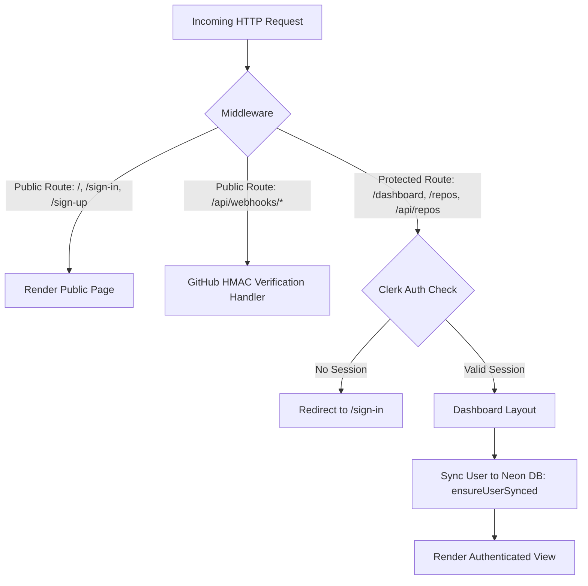

# Clerk Authentication Guide

**LS Ship** uses [Clerk](https://clerk.com/) (`@clerk/nextjs`) for secure user authentication, session management, sign-in/sign-up components, and route protection.

---

## 🎯 Architecture & Capabilities



---

## ⚙️ Configuration & Environment Variables

Add your Clerk API keys to `.env.local`:

```env
NEXT_PUBLIC_CLERK_PUBLISHABLE_KEY=pk_test_...
CLERK_SECRET_KEY=sk_test_...
```

- `NEXT_PUBLIC_CLERK_PUBLISHABLE_KEY`: Accessible in client and server bundles; used by `<ClerkProvider>` to initialize the frontend authentication state.
- `CLERK_SECRET_KEY`: Server-only secret key used to verify session tokens, decode JWTs, and invoke backend Clerk APIs.

---

## 🛡️ Route Protection Middleware

Located at [`middleware.ts`](file:///c:/Users/Girish%20Lade/OneDrive/Desktop/LS-Relay/ls-ship/middleware.ts):

```typescript
import { clerkMiddleware, createRouteMatcher } from "@clerk/nextjs/server";

const isPublicRoute = createRouteMatcher([
  // Marketing landing page & auth pages
  "/",
  "/sign-in(.*)",
  "/sign-up(.*)",
  // GitHub calls webhooks server-to-server; authenticated by HMAC signature, not Clerk cookies
  "/api/webhooks(.*)",
]);

export default clerkMiddleware(async (auth, req) => {
  if (!isPublicRoute(req)) {
    auth().protect();
  }
});

export const config = {
  matcher: [
    "/((?!_next|[^?]*\\.(?:html?|css|js(?!on)|jpe?g|webp|png|gif|svg|ttf|woff2?|ico|csv|docx?|xlsx?|zip|webmanifest)).*)",
    "/(api|trpc)(.*)",
  ],
};
```

### Key Security Decisions:
1. **Public Routes**: `/`, `/sign-in`, `/sign-up`, and `/api/webhooks/*` are excluded from session redirects.
2. **Webhook Exemption**: Webhook endpoints cannot be protected by session cookies because GitHub dispatches them server-to-server. Webhooks are authenticated via HMAC SHA-256 signatures instead.
3. **Implicit Protection**: Any newly created route or API handler is private by default unless explicitly added to `isPublicRoute`.

---

## 👥 Database User Mirroring (`ensureUserSynced`)

Located at [`lib/db/queries.ts`](file:///c:/Users/Girish%20Lade/OneDrive/Desktop/LS-Relay/ls-ship/lib/db/queries.ts) and [`app/(dashboard)/layout.tsx`](file:///c:/Users/Girish%20Lade/OneDrive/Desktop/LS-Relay/ls-ship/app/%28dashboard%29/layout.tsx):

When an authenticated user loads the dashboard layout, LS Ship checks if their Clerk `userId` exists in the local PostgreSQL database:

```typescript
export async function ensureUserSynced(
  clerkUserId: string,
  email: string
): Promise<void> {
  await db
    .insert(users)
    .values({ id: clerkUserId, email })
    .onConflictDoNothing({ target: users.id });
}
```

### Why User Mirroring is Essential:
1. **Foreign Key Integrity**: Tables like `integrations`, `repos`, and `webhookEvents` enforce referential integrity via `references(() => users.id, { onDelete: "cascade" })`.
2. **Asynchronous Webhook Execution**: When GitHub sends a push webhook, the handler receives a `repoId`. It resolves the owning `userId` from the database directly in a single query without needing external HTTP calls to Clerk.

---

## 🔒 CSRF Protection via Clerk User ID Binding

Across all OAuth integrations (GitHub, Jira, Slack, Notion), LS Ship uses the Clerk `userId` of the active session as the OAuth `state` parameter:

1. **Connect Route (`/connect`)**:
   ```typescript
   const { userId } = await auth();
   const params = new URLSearchParams({ ..., state: userId });
   ```
2. **Callback Route (`/callback`)**:
   ```typescript
   const { userId } = await auth();
   const state = url.searchParams.get("state");
   if (!userId || !state || state !== userId) {
     return NextResponse.redirect(new URL("/integrations?error=oauth_state", url));
   }
   ```

### Security Benefits:
- Guarantees that the session completing the OAuth callback is the exact same user session that initiated it.
- Prevents cross-site request forgery attacks where an attacker tricks a user into linking the attacker's third-party account.
