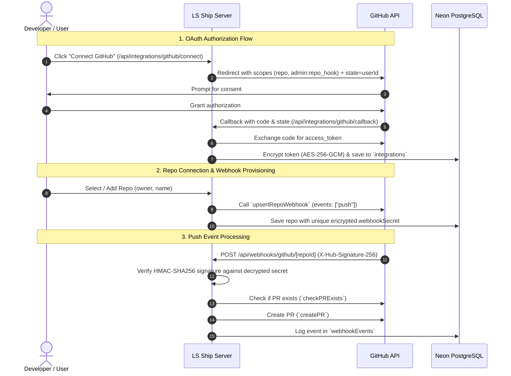

# GitHub Integration Guide

The **GitHub Integration** allows **LS Ship** to inspect pushed commits, manage repository webhooks automatically, verify HMAC payload authenticity, check for existing pull requests, and automatically open new pull requests targeted at specified base branches.

---

## 🎯 Architecture & Capabilities



---

## ⚙️ Prerequisites & Setup

### Step 1: Create a GitHub OAuth App

1. Log into GitHub and go to **Settings** -> **Developer settings** -> **OAuth Apps** -> **New OAuth App**.
2. Fill out the application details:
   - **Application name**: `LS Ship`
   - **Homepage URL**: `https://<your-domain>` (or `http://localhost:3000`)
   - **Authorization callback URL**: `https://<your-domain>/api/integrations/github/callback`
3. Click **Register application**.
4. Copy the **Client ID** and generate a new **Client Secret**.
5. Save both in `.env.local`:
   ```env
   GITHUB_APP_CLIENT_ID=Iv1.xxxxxxxxxxxx
   GITHUB_APP_CLIENT_SECRET=xxxxxxxxxxxxxxxxxxxxxxxxxxxxxxxxxxxxxxxx
   ```

---

## 🔐 Permissions & OAuth Scopes

LS Ship requests the following OAuth scopes during the connect flow:

| Scope | Purpose | Why It Is Mandatory |
| :--- | :--- | :--- |
| `repo` | Grants full access to public and private repositories, commit metadata, and pull requests. | Required to list repositories, query open pull requests, and programmatically open new pull requests across public and private repositories. |
| `admin:repo_hook` | Grants read and write access to repository webhooks. | Allows LS Ship to provision, update, and manage push webhooks automatically when a user connects a repository without manual copy/pasting. |

---

## 🔄 OAuth 2.0 Flow Implementation

### 1. Initiation (`/api/integrations/github/connect`)

Located at [`app/api/integrations/github/connect/route.ts`](file:///c:/Users/Girish%20Lade/OneDrive/Desktop/LS-Relay/ls-ship/app/api/integrations/github/connect/route.ts):

- Authenticates the current session using `@clerk/nextjs/server`.
- Constructs the authorization URL targeting `https://github.com/login/oauth/authorize`.
- **CSRF State Protection**: Passes the authenticated Clerk `userId` as the `state` parameter.

### 2. Callback & Token Exchange (`/api/integrations/github/callback`)

Located at [`app/api/integrations/github/callback/route.ts`](file:///c:/Users/Girish%20Lade/OneDrive/Desktop/LS-Relay/ls-ship/app/api/integrations/github/callback/route.ts):

- Validates that the received `state` strictly matches the active session's `userId`.
- Sends a `POST` request to `https://github.com/login/oauth/access_token` to exchange the authorization code for an `access_token`.
- Encrypts the token using `encrypt(accessToken)` from [`lib/crypto.ts`](file:///c:/Users/Girish%20Lade/OneDrive/Desktop/LS-Relay/ls-ship/lib/crypto.ts).
- Persists the credentials via `upsertIntegration(userId, "github", { encryptedAccessToken })`.
- Redirects back to `/integrations?success=github`.

> [!NOTE]
> GitHub OAuth App access tokens do not expire by default and do not issue refresh tokens. If a user revokes authorization on GitHub, subsequent API requests will fail with HTTP 401, prompting the user to reconnect.

---

## 📦 Repository Listing API

Located at [`app/api/integrations/github/repos/route.ts`](file:///c:/Users/Girish%20Lade/OneDrive/Desktop/LS-Relay/ls-ship/app/api/integrations/github/repos/route.ts):

- Retrieves the decrypted GitHub access token for the logged-in user.
- Initializes the Octokit client (`getGithubClient`).
- Paginates through `octokit.repos.listForAuthenticatedUser` up to 5 pages (500 repositories max).
- Returns repository metadata (`owner`, `name`, `defaultBranch`, `isPrivate`) to populate the interactive repository picker in the dashboard.

---

## 🪝 Automated Webhook Provisioning

Located at [`lib/github/webhooks.ts`](file:///c:/Users/Girish%20Lade/OneDrive/Desktop/LS-Relay/ls-ship/lib/github/webhooks.ts):

When a repository is added via the dashboard:
1. LS Ship generates a cryptographically random 32-byte hex secret (`randomBytes(32).toString('hex')`).
2. Constructs the payload URL: `https://<your-domain>/api/webhooks/github/<repoId>`.
3. Calls `upsertRepoWebhook()`:
   - Queries `octokit.repos.listWebhooks` to check if a webhook with the matching URL already exists.
   - If found, updates the webhook with the new secret and ensures `events: ["push"]` and `active: true`.
   - If not found, creates a new webhook via `octokit.repos.createWebhook`.
4. **Fallback Handling**: If the user lacks admin privileges on an organization repository, the API returns a friendly error message and provides a manual setup card with the one-time plaintext secret.

---

## 🛡️ Webhook Signature Verification

Located at [`lib/github/verify-signature.ts`](file:///c:/Users/Girish%20Lade/OneDrive/Desktop/LS-Relay/ls-ship/lib/github/verify-signature.ts):

GitHub signs each webhook payload by computing an HMAC-SHA256 digest over the raw request body using the configured webhook secret.

```typescript
export function verifyGithubSignature(
  rawBody: string,
  signatureHeader: string | null,
  secret: string
): boolean {
  if (!signatureHeader || !signatureHeader.startsWith("sha256=")) {
    return false;
  }

  const expected = "sha256=" + createHmac("sha256", secret).update(rawBody, "utf8").digest("hex");
  const expectedBuf = Buffer.from(expected, "utf8");
  const receivedBuf = Buffer.from(signatureHeader, "utf8");

  if (expectedBuf.length !== receivedBuf.length) {
    return false;
  }

  return timingSafeEqual(expectedBuf, receivedBuf);
}
```

### Critical Security Points:
- The raw request body is read with `await request.text()` before JSON parsing. Re-serialized JSON will alter whitespace and fail HMAC validation.
- `crypto.timingSafeEqual` prevents timing attacks against signature comparisons.

---

## 🚀 Pull Request Automation Logic

Located at [`lib/github/pr.ts`](file:///c:/Users/Girish%20Lade/OneDrive/Desktop/LS-Relay/ls-ship/lib/github/pr.ts):

### 1. Duplicate PR Check (`checkPRExists`)
Before creating a PR, LS Ship queries `octokit.pulls.list` with filters:
- `owner`: Repository owner
- `repo`: Repository name
- `head`: `${owner}:${pushBranch}`
- `state`: `"open"`

If an open PR already exists for that branch, the status is marked as `pr_exists` and the existing PR URL is preserved without creating duplicates.

### 2. PR Creation (`createPR`)
If no PR exists, LS Ship calls `octokit.pulls.create`:
```typescript
await createPR(octokit, {
  owner: repo.owner,
  repo: repo.name,
  title: `${commit.jiraKey} ${commit.commitDescription}`,
  head: commit.pushBranch,
  base: commit.baseBranch ?? repo.defaultBaseBranch ?? "main",
  body: `Auto Generated PR for Jira Task ${commit.jiraKey}`,
});
```

---

## 🩺 Troubleshooting

### 1. `403 Forbidden` When Adding Organization Repos
- **Cause**: The GitHub user account does not have Admin access on the organization repository, so GitHub prevents webhook creation.
- **Solution**: Follow the manual webhook configuration instructions shown in the LS Ship UI.

### 2. `404 Not Found` During Webhook Creation
- **Cause**: The OAuth token was granted before `admin:repo_hook` was added to scopes, or the user has not authorized the OAuth app on their organization.
- **Solution**: Go to the **Integrations** page and click **Reconnect** next to GitHub. Ensure you grant access to the appropriate organization during consent.

### 3. `invalid_signature` in Webhook Logs
- **Cause**: Webhook secret mismatch or body alteration.
- **Solution**: If the secret was rotated or regenerated, update the secret in GitHub repository settings under **Settings** -> **Webhooks**.
