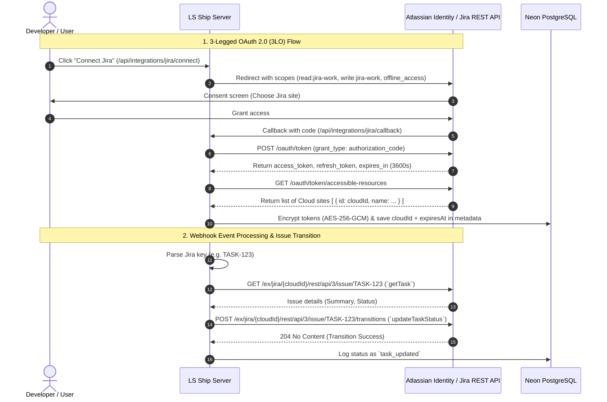

# Atlassian Jira Cloud Integration Guide

The **Jira Integration** enables **LS Ship** to verify Jira issue keys extracted from commit messages and transition issues into the **Development Done** state when commits include the `[taskcompleted]` automation flag.

---

## 🎯 Architecture & Capabilities



---

## ⚙️ Prerequisites & Setup

### Step 1: Create an OAuth 2.0 (3LO) App in Atlassian Console

1. Navigate to the [Atlassian Developer Console](https://developer.atlassian.com/console/myapps/).
2. Click **Create** -> **OAuth 2.0 integration**.
3. Provide an app name (e.g., `LS Ship Automation`).
4. In the left menu, select **Permissions**:
   - Find **Jira platform REST API** and click **Add**.
   - Click **Configure** and add the following scopes:
     - `read:jira-work`
     - `write:jira-work`
5. In the left menu, select **Authorization**:
   - Click **Add** next to **OAuth 2.0 (3LO)**.
   - Enter your **Callback URL**:
     ```
     https://<your-domain>/api/integrations/jira/callback
     ```
     *(For local development: `http://localhost:3000/api/integrations/jira/callback`)*
6. In the left menu, click **Settings**:
   - Copy your **Client ID** and **Secret**.
7. Add these credentials to your `.env.local`:
   ```env
   JIRA_CLIENT_ID=xxxxxxxxxxxxxxxxxxxx
   JIRA_CLIENT_SECRET=ATOAxxxxxxxxxxxxxxxxxxxxxxxxxxxxxxxxxxxx
   ```

---

## 🔐 Permissions & OAuth Scopes

| Scope | Purpose | Why It Is Mandatory |
| :--- | :--- | :--- |
| `read:jira-work` | Read Jira issues, projects, and metadata. | Used by `getTask` to verify that an issue exists and fetch its summary before performing automation. |
| `write:jira-work` | Transition issue statuses and update fields. | Required to execute workflow transitions (e.g. move issue to Development Done). |
| `offline_access` | Issues a long-lived `refresh_token`. | **Critical**: Jira access tokens expire after **1 hour (3600 seconds)**. Without `offline_access`, automated tasks would fail when tokens expire. |

---

## 🔄 OAuth Flow & Cloud ID Resolution

### 1. Initiation (`/api/integrations/jira/connect`)

Located at [`app/api/integrations/jira/connect/route.ts`](file:///c:/Users/Girish%20Lade/OneDrive/Desktop/LS-Relay/ls-ship/app/api/integrations/jira/connect/route.ts):

- Directs the browser to `https://auth.atlassian.com/authorize`.
- Request Parameters:
  - `audience`: `api.atlassian.com`
  - `prompt`: `consent` (Ensures a refresh token is always returned)
  - `response_type`: `code`
  - `scope`: `read:jira-work write:jira-work offline_access`
  - `state`: Active Clerk `userId` (for CSRF validation)

### 2. Callback & Site Resolution (`/api/integrations/jira/callback`)

Located at [`app/api/integrations/jira/callback/route.ts`](file:///c:/Users/Girish%20Lade/OneDrive/Desktop/LS-Relay/ls-ship/app/api/integrations/jira/callback/route.ts):

1. Verifies the `state` matches the active session.
2. Exchanges the `code` for an `access_token` and `refresh_token` via `https://auth.atlassian.com/oauth/token`.
3. Calls the Atlassian **Accessible Resources API**:
   ```
   GET https://api.atlassian.com/oauth/token/accessible-resources
   ```
4. Extracts the primary `cloudId` (identifying the Jira Cloud tenant instance).
5. Encrypts both tokens with AES-256-GCM.
6. Saves metadata:
   ```json
   {
     "cloudId": "abc12345-6789-0123-4567-89abcdef0123",
     "expiresAt": "2026-08-23T02:22:00.000Z"
   }
   ```

---

## 🔄 Token Expiration & Refresh Flow

Located at [`lib/jira/refresh.ts`](file:///c:/Users/Girish%20Lade/OneDrive/Desktop/LS-Relay/ls-ship/lib/jira/refresh.ts):

Jira tokens expire after 60 minutes. The `refreshJiraToken` helper handles refreshing:

```typescript
export async function refreshJiraToken(
  refreshToken: string
): Promise<{ accessToken: string; refreshToken: string }> {
  const response = await fetch("https://auth.atlassian.com/oauth/token", {
    method: "POST",
    headers: {
      Accept: "application/json",
      "Content-Type": "application/json",
    },
    body: JSON.stringify({
      grant_type: "refresh_token",
      client_id: process.env.JIRA_CLIENT_ID,
      client_secret: process.env.JIRA_CLIENT_SECRET,
      refresh_token: refreshToken,
    }),
  });

  const data = await response.json();
  return {
    accessToken: data.access_token,
    refreshToken: data.refresh_token ?? refreshToken,
  };
}
```

---

## 🌐 Jira REST API Client

Located at [`lib/jira/client.ts`](file:///c:/Users/Girish%20Lade/OneDrive/Desktop/LS-Relay/ls-ship/lib/jira/client.ts):

All Jira Cloud requests route through Atlassian's tenant-exchange gateway:

```
https://api.atlassian.com/ex/jira/{cloudId}/rest/api/3{path}
```

- **Authentication Header**: `Authorization: Bearer <accessToken>`
- **Timeout**: 10,000 ms via `AbortSignal.timeout(10_000)`
- **Error Truncation**: Truncates response bodies to 500 characters to prevent huge HTML error pages from cluttering logs while preserving exact error details.

---

## 🛠️ Jira Operations

### 1. Task Existence Verification (`getTask`)

Located at [`lib/jira/task.ts`](file:///c:/Users/Girish%20Lade/OneDrive/Desktop/LS-Relay/ls-ship/lib/jira/task.ts):

```typescript
export async function getTask(
  creds: JiraCreds,
  issueKey: string
): Promise<JiraTask | null>
```

- Calls `GET /issue/{issueKey}`.
- If the issue does not exist, Jira returns HTTP 404. `getTask` catches this and returns `null` safely, preventing crashes when commits reference non-existent or typos of task keys.

### 2. Transitioning Tasks (`updateTaskStatus`)

Located at [`lib/jira/task.ts`](file:///c:/Users/Girish%20Lade/OneDrive/Desktop/LS-Relay/ls-ship/lib/jira/task.ts):

```typescript
export async function updateTaskStatus(
  creds: JiraCreds,
  issueKey: string,
  statusId: string
): Promise<void>
```

- Calls `POST /issue/{issueKey}/transitions` with payload:
  ```json
  {
    "transition": {
      "id": "61"
    }
  }
  ```
- **Transition ID `61`**: Represents "Development Done" in standard Jira Software workflows.

---

## 🩺 Troubleshooting

### 1. `Jira task TASK-123 not found`
- **Cause**: The commit references an issue key that does not exist in the connected Jira Cloud instance or the user lacks permission to view that project.
- **Resolution**: Verify the project key prefix and ensure the connected user has access to that Jira project.

### 2. `Jira API /issue/... failed (400): {"errorMessages":["Transition id '61' is not valid..."]}`
- **Cause**: Your Jira workflow does not use transition ID `61` for "Development Done" or the current issue status cannot transition directly to that state.
- **Resolution**: Check the transitions available on your Jira workflow by querying `/rest/api/3/issue/{key}/transitions`.
