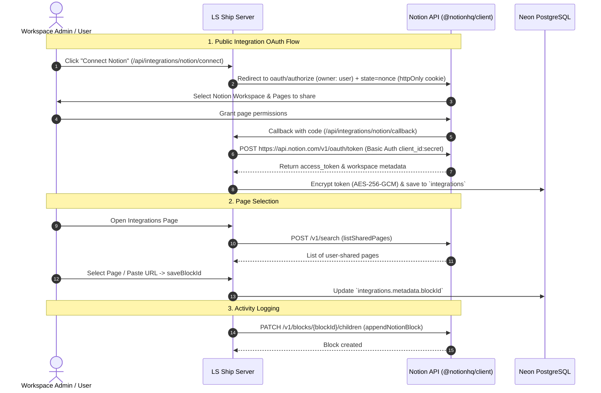

# Notion Integration Guide

The **Notion Integration** allows **LS Ship** to maintain an append-only audit trail and activity log within a designated Notion page. Every time a PR is opened or a Jira task status transitions, LS Ship appends a structured log block directly to the specified page.

---

## 🎯 Architecture & Capabilities



---

## ⚙️ Prerequisites & Setup

### Step 1: Create a Public Notion Integration

1. Go to [notion.so/my-integrations](https://www.notion.so/my-integrations).
2. Click **+ New integration**.
3. Fill in the integration details:
   - **Name**: `LS Ship Automation`
   - **Associated workspace**: Select your workspace.
   - **Type**: **Public** *(Public integration is required for OAuth 2.0 flow)*.
4. Under **OAuth Domain & URIs**:
   - **Redirect URIs**: Add:
     ```
     https://<your-domain>/api/integrations/notion/callback
     ```
     *(For local development: `http://localhost:3000/api/integrations/notion/callback`)*
5. Under **Capabilities**, enable:
   - ✅ **Read content**
   - ✅ **Update content**
   - ✅ **Insert content**
   - ❌ *No user information needed*
6. Click **Submit** / **Save changes**.
7. Copy your **OAuth Client ID** and **OAuth Client Secret**.
8. Add them to `.env.local`:
   ```env
   NOTION_CLIENT_ID=xxxxxxxx-xxxx-xxxx-xxxx-xxxxxxxxxxxx
   NOTION_CLIENT_SECRET=secret_xxxxxxxxxxxxxxxxxxxxxxxxxxxxxxxx
   ```

---

## 🔄 OAuth 2.0 Flow Implementation

### 1. Initiation (`/api/integrations/notion/connect`)

Located at [`app/api/integrations/notion/connect/route.ts`](file:///c:/Users/Girish%20Lade/OneDrive/Desktop/LS-Relay/ls-ship/app/api/integrations/notion/connect/route.ts):

- Directs the browser to `https://api.notion.com/v1/oauth/authorize`.
- Request Parameters:
  - `client_id`: `process.env.NOTION_CLIENT_ID`
  - `response_type`: `code`
  - `owner`: `user`
  - `redirect_uri`: Canonical callback URL
  - `state`: Active Clerk `userId` for CSRF validation

### 2. Callback & HTTP Basic Token Exchange (`/api/integrations/notion/callback`)

Located at [`app/api/integrations/notion/callback/route.ts`](file:///c:/Users/Girish%20Lade/OneDrive/Desktop/LS-Relay/ls-ship/app/api/integrations/notion/callback/route.ts):

> [!NOTE]
> **Notion Authorization Requirement**: Per Notion's OAuth specification, the token endpoint authenticates the integration using **HTTP Basic Authentication** (`Authorization: Basic base64(client_id:client_secret)`), unlike standard body-parameter OAuth endpoints.

```typescript
const response = await fetch("https://api.notion.com/v1/oauth/token", {
  method: "POST",
  headers: {
    Accept: "application/json",
    "Content-Type": "application/json",
    Authorization: `Basic ${Buffer.from(`${clientId}:${clientSecret}`).toString("base64")}`,
  },
  body: JSON.stringify({
    grant_type: "authorization_code",
    code,
    redirect_uri: redirectUri,
  }),
});
```

The resulting `access_token` is encrypted and saved into `integrations`.

---

## 📄 Page Discovery & Selection

### 1. Listing Shared Pages (`lib/notion/pages.ts`)

Located at [`lib/notion/pages.ts`](file:///c:/Users/Girish%20Lade/OneDrive/Desktop/LS-Relay/ls-ship/lib/notion/pages.ts):

- Initializes the official Notion SDK (`Client` from `@notionhq/client`).
- Calls `notion.search({ filter: { property: "object", value: "page" } })`.
- Extracts page titles from polymorphic properties.
- **Notion Permission Model**: Notion only returns pages that the user has explicitly shared with the integration during authorization or via the page's "Add connections" menu.

### 2. Page URL & Block ID Parser (`saveBlockId`)

Located at [`app/(dashboard)/integrations/actions.ts`](file:///c:/Users/Girish%20Lade/OneDrive/Desktop/LS-Relay/ls-ship/app/%28dashboard%29/integrations/actions.ts):

Users can select a page from the dropdown or paste any standard Notion page URL. The server action extracts the 32-character hexadecimal page ID using regex:

```typescript
const match = raw.match(/\b([0-9a-f]{32})\b/i);
```

Supported Formats:
- Direct 32-char hex ID: `4f7e2a9b1c8d4e5f6a7b8c9d0e1f2a3b`
- Formatted UUID: `4f7e2a9b-1c8d-4e5f-6a7b-8c9d0e1f2a3b`
- Notion Full URL: `https://www.notion.so/workspace/Release-Log-4f7e2a9b1c8d4e5f6a7b8c9d0e1f2a3b`

The extracted `blockId` is saved in `integrations.metadata.blockId`.

---

## ✍️ Appending Activity Blocks

Located at [`lib/notion/notify.ts`](file:///c:/Users/Girish%20Lade/OneDrive/Desktop/LS-Relay/ls-ship/lib/notion/notify.ts):

```typescript
export async function appendNotionBlock(
  accessToken: string,
  blockId: string,
  text: string
): Promise<void> {
  const notion = new Client({ auth: accessToken });

  await notion.blocks.children.append({
    block_id: blockId,
    children: [
      {
        object: "block",
        type: "paragraph",
        paragraph: {
          rich_text: [{ type: "text", text: { content: text } }],
        },
      },
    ],
  });
}
```

Every event is appended cleanly to the bottom of the designated page as an unformatted text paragraph.

---

## 🩺 Troubleshooting

### 1. Dropdown Shows "Untitled page" or No Pages Found
- **Cause**: When connecting Notion, the user must check the boxes next to the specific pages they want the integration to access.
- **Solution**:
  1. Open the target Notion page in your browser.
  2. Click the `...` menu in the top right -> **Connections** -> **Add connection**.
  3. Select **LS Ship**.
  4. Alternatively, click **Reconnect** on the LS Ship Integrations page and re-select your pages.

### 2. `object_not_found` Error
- **Cause**: The page was deleted, archived, or permission was revoked.
- **Solution**: Re-select a valid shared page from the Integrations dashboard.
