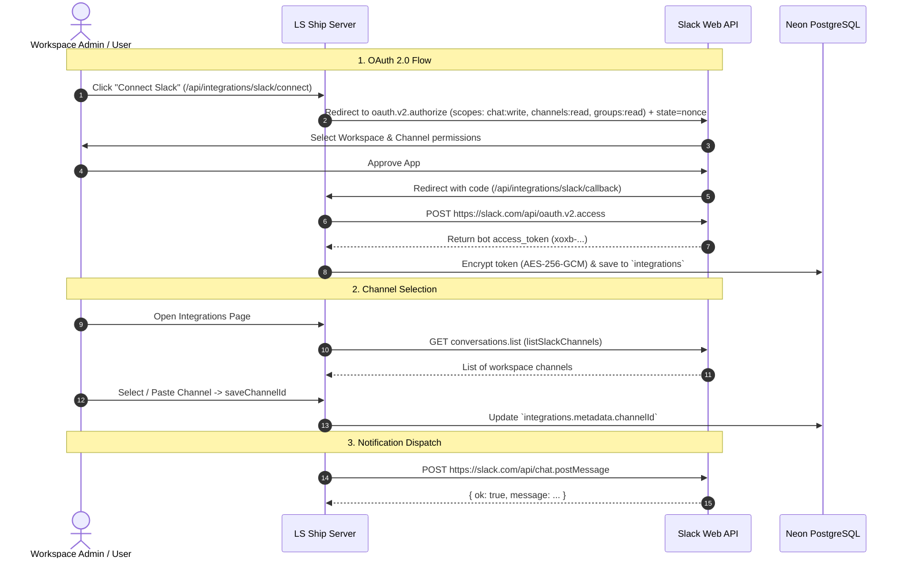

# Slack Integration Guide

The **Slack Integration** enables **LS Ship** to post real-time updates directly into your team's designated Slack channels whenever pull requests are opened, duplicate PRs are detected, or Jira tasks are moved to "Development Done".

---

## 🎯 Architecture & Capabilities



---

## ⚙️ Prerequisites & Setup

### Step 1: Create a Slack App

1. Visit [api.slack.com/apps](https://api.slack.com/apps).
2. Click **Create New App** -> **From scratch**.
3. Set an **App Name** (e.g. `LS Ship`) and select your **Development Slack Workspace**.
4. Navigate to **OAuth & Permissions** in the sidebar:
   - Under **Redirect URLs**, click **Add New Redirect URL**:
     ```
     https://<your-domain>/api/integrations/slack/callback
     ```
     *(For local development: `http://localhost:3000/api/integrations/slack/callback`)*
   - Click **Save URLs**.
5. Scroll down to **Scopes** -> **Bot Token Scopes** and add:
   - `chat:write` — Allows the bot to post messages to channels.
   - `channels:read` — *(Required)* Lists public channels in the workspace.
   - `groups:read` — *(Required)* Lists private channels where the bot is invited.
6. In the left sidebar, navigate to **Basic Information**:
   - Under **App Credentials**, copy your **Client ID** and **Client Secret**.
7. Store the credentials in your `.env.local`:
   ```env
   SLACK_CLIENT_ID=1234567890123.1234567890123
   SLACK_CLIENT_SECRET=abcdef0123456789abcdef0123456789
   ```

---

## 🔄 OAuth 2.0 Flow Implementation

### 1. Initiation (`/api/integrations/slack/connect`)

Located at [`app/api/integrations/slack/connect/route.ts`](file:///c:/Users/Girish%20Lade/OneDrive/Desktop/LS-Relay/ls-ship/app/api/integrations/slack/connect/route.ts):

- Directs the browser to `https://slack.com/oauth/v2/authorize`.
- Passes the authenticated Clerk `userId` as `state` for CSRF validation.
Requests the chat:write, channels:read, and groups:read bot scopes.

### 2. Callback & Token Exchange (`/api/integrations/slack/callback`)

Located at [`app/api/integrations/slack/callback/route.ts`](file:///c:/Users/Girish%20Lade/OneDrive/Desktop/LS-Relay/ls-ship/app/api/integrations/slack/callback/route.ts):

- Submits the temporary `code` to `https://slack.com/api/oauth.v2.access` with `Content-Type: application/x-www-form-urlencoded`.
- Receives the bot user token (`access_token` starting with `xoxb-`).
- Encrypts the bot token using `encrypt()` and saves it into the `integrations` table.
- Redirects to `/integrations?success=slack`.

---

## 📢 Channel Discovery & Selection

### 1. Listing Channels (`lib/slack/channels.ts`)

Located at [`lib/slack/channels.ts`](file:///c:/Users/Girish%20Lade/OneDrive/Desktop/LS-Relay/ls-ship/lib/slack/channels.ts):

- Queries `https://slack.com/api/conversations.list`.
- Handles cursor-based pagination (`response_metadata.next_cursor`) to fetch up to 1,000 active channels.
- Filters out archived channels (`!channel.is_archived`).
- Exposes data to the frontend via [`app/api/integrations/slack/channels/route.ts`](file:///c:/Users/Girish%20Lade/OneDrive/Desktop/LS-Relay/ls-ship/app/api/integrations/slack/channels/route.ts).

### 2. Channel Link & ID Parser (`saveChannelId`)

Located at [`app/(dashboard)/integrations/actions.ts`](file:///c:/Users/Girish%20Lade/OneDrive/Desktop/LS-Relay/ls-ship/app/%28dashboard%29/integrations/actions.ts):

Users can either select a channel from the dropdown or paste a channel link directly. The server action extracts the channel ID using a regular expression:

```typescript
const match = raw.match(/\bC[A-Z0-9]{8,}\b/i);
```

Supported Formats:
- Direct Channel ID: `C0123ABCD9`
- Slack Archive URL: `https://app.slack.com/client/T0123/C0123ABCD9`
- Message URL: `https://myteam.slack.com/archives/C0123ABCD9/p1690000000000`

The extracted `channelId` is stored in `integrations.metadata.channelId`.

---

## 💬 Message Dispatch & Error Handling

Located at [`lib/slack/notify.ts`](file:///c:/Users/Girish%20Lade/OneDrive/Desktop/LS-Relay/ls-ship/lib/slack/notify.ts):

```typescript
export async function postSlackMessage(
  accessToken: string,
  channelId: string,
  text: string
): Promise<void> {
  const response = await fetch("https://slack.com/api/chat.postMessage", {
    method: "POST",
    headers: {
      Authorization: `Bearer ${accessToken}`,
      "Content-Type": "application/json",
      Accept: "application/json",
    },
    body: JSON.stringify({ channel: channelId, text }),
    signal: AbortSignal.timeout(10_000),
  });

  const data = await response.json();
  if (!data.ok) {
    throw new Error(`Slack chat.postMessage failed: ${data.error ?? "unknown_error"}`);
  }
}
```

> [!IMPORTANT]
> **Slack Web API Gotcha**: Unlike typical REST APIs, Slack returns HTTP 200 OK even for failed requests. The response body contains `{ ok: false, error: "channel_not_found" }`. LS Ship explicitly checks `!data.ok` to throw an actionable error.

---

## 📝 Notification Examples

| Event Trigger | Notification Message Format |
| :--- | :--- |
| **New PR Created** | `[LS Ship] Opened a PR for TASK-101 on org/repo: https://github.com/org/repo/pull/12` |
| **PR Already Exists** | `[LS Ship] PR already open for TASK-101 on org/repo: https://github.com/org/repo/pull/12` |
| **Task Completed** | `[LS Ship] Marked TASK-101 as Development Done on org/repo` |

---

## 🩺 Troubleshooting

### 1. `channel_not_found` or `not_in_channel`
- **Cause**: The bot is trying to post to a private channel it hasn't been invited to.
- **Solution**: In Slack, open the target channel, type `/invite @LS Ship`, and press Enter.

### 2. `invalid_auth` or `token_revoked`
- **Cause**: The app was uninstalled from the workspace or tokens were revoked.
- **Solution**: Go to the **Integrations** page and click **Reconnect** next to Slack.
